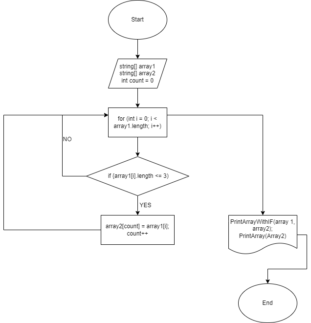

# Итоговая проверочная работа

> **Задача**

*Написать программу, которая из имеющегося массива строк формирует массив из строк, длина которых меньше либо равна 3 символа. Первоначальный массив можно ввести с клавиатуры, либо задать на старте выполнения алгоритма. При решение не рекомендуется пользоваться коллекциями, лучше обойтись исключительно массивами*

> **Блок-схема решения задачи**

> **Алгоритм решения задачи**

* Объявление двух массивов: изначальный и вторый такой же длины. 
* Создание метода, в котором цикл соразмерный длине массива.
* Внутри цикла проверка условия ( <=3 ), если *ДА* элемент первого массива заносится в count элемент второго массива (переменная count чтобы поочередно закидывать из первого массива во второй и чтобы потом не было пробелов). 
* После присвоения увеличивается переменная count на 1 и возвращается к циклу for в котором i увеличивается на 1. И так идет проверка до конца.